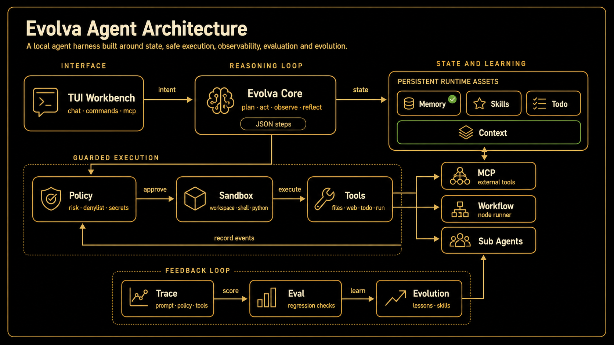
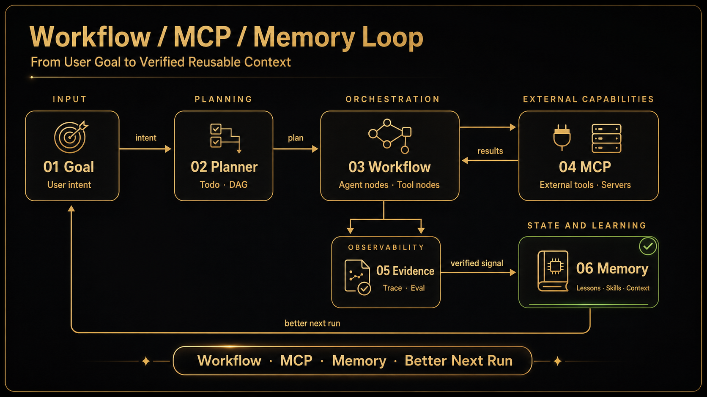

<p align="center">
  
</p>

<h1 align="center">Evolva</h1>

<p align="center">
  <strong>Run agents locally. Preserve the evidence. Keep execution inside explicit boundaries.</strong><br />
  A workbench for real repositories: it can plan, use tools, recover work, and explain what it did.
</p>

<p align="center">
  <a href="README.md">中文</a> ·
  <a href="#quick-start">Quick Start</a> ·
  <a href="#capabilities">Capabilities</a> ·
  <a href="#loop-engineering">Loop Engineering</a> ·
  <a href="#production-boundaries">Production</a>
</p>

<p align="center">
  <a href="https://github.com/koppx/Evolva/stargazers">
    
  </a>
  
  
  
</p>

<p align="center">
  
</p>

Once an agent starts working in a real repository, answer quality is only part of the job. It also needs to find the right context, use tools within clear limits, recover from failures, and leave a record people can review. Evolva is built around those needs.

```text
Plan -> Act -> Observe -> Evaluate -> Evolve
```

- **Bounded before execution**: policy, approvals, and sandbox backends govern files, Shell, Python, and MCP.
- **Stateful during execution**: workflows, loops, and sessions preserve progress for recovery and retry.
- **Evidence after execution**: traces, artifacts, and evals record results; only verified experience reaches Memory or Skills.

## Quick Start

Python 3.10+ is required. [uv](https://docs.astral.sh/uv/) is recommended:

```bash
git clone https://github.com/koppx/Evolva.git
cd Evolva
uv sync
uv run evolva
```

Or install a global command with pipx:

```bash
pipx install git+https://github.com/koppx/Evolva.git
evolva
```

Inside the TUI, run `/config wizard` to connect any OpenAI-compatible model. Without a model, file tools, traces, workflows, and evals remain available in local rule mode.

```text
/config wizard             Configure model, base_url, api_key, and temperature
/repo build                Index the current repository
Review this repository     Start a task
/trace list                Inspect execution records
/session list              List persisted sessions
/resume                    List and continue interrupted agent runs
/cancel                    Stop the active task, or press Ctrl+K
```

Runtime state lives under `.evolva/`, separate from source code. Set `EVOLVA_RUNTIME_HOME` to place it on a dedicated volume.

> **Security note:** the default `local` backend is for development. It does not isolate host reads or processes. Production requires an isolated backend; see [Production Boundaries](#production-boundaries).

## Capabilities

| Use case | What Evolva provides | Entry |
| --- | --- | --- |
| Understand a repository | File, symbol, reference, and pluggable semantic retrieval | `/repo` |
| Execute work | Dynamic tool selection, native tool calls, conflict-aware patches, diffs, and tests | Chat / `/run` |
| Run complex processes | Recoverable workflows and quality-gated loops | `/workflow` / `/loop` |
| Coordinate roles | Task Router, dependency DAGs, bounded sub-agents, conflict detection, and synthesis | `/agents` |
| Review and regress | Trace, artifact manifests, replay, and JSONL evals | `/trace` / `evolva eval` |
| Retain experience | Namespaced Memory and Skills with TTL, conflicts, and verification | `/memory` / `/dream` |

## Architecture

<p align="center">
  
</p>

The runtime has three main lanes:

1. **Reasoning & State**: TUI, Core, Session, Context, and Repo Index organize task context by relevance and budget.
2. **Guarded Execution**: calls pass through policy, approval, and sandbox controls; production command execution requires strong isolation.
3. **Evidence & Learning**: the main loop checks readback, diff, or test evidence before completion; bounded recovery handles failures, checkpoints resume interrupted runs, and only verified experience is promoted.

Optional model tiers provide ordered failover through `EVOLVA_MODEL_FAST`, `EVOLVA_MODEL_CODING`, `EVOLVA_MODEL_REASONING`, and comma-separated `EVOLVA_MODEL_FALLBACKS`. With no tier configured, Evolva continues to use `OPENAI_MODEL`.

## Loop Engineering

Loops are for work that repeats and must be verified. A natural-language request becomes a reviewable draft before execution; each phase can declare dependencies, budgets, gates, and artifacts.

<p align="center">
  
</p>

```text
/loop Run release checks: tests, typing, and security evals
/loop revise Fix only related modules and retry at most twice
/loop confirm
/loop execute
/loop save release-check
```

Built-in loops:

| Loop | Purpose |
| --- | --- |
| `release-readiness-loop` | Check tests, CLI, Trace, and Dream state before release |
| `eval-regression-loop` | Run regressions and preserve failures as verifiable candidates |
| `repo-improvement-loop` | Index a repository, scan it, and feed evidence back into the runtime |
| `dream-loop` | Generate improvement candidates from Trace, Eval, and Memory |

A Loop is an engineering feedback cycle. Workflow is the general DAG layer underneath it.

## Workflow / MCP / Memory

<p align="center">
  
</p>

Workflow supports successful-node resume, node retries, conditions, timeouts, bounded parallelism, and failure compensation.

```json
{
  "id": "repository_review",
  "nodes": [
    {
      "id": "search",
      "type": "tool",
      "tool": "repo_index_search",
      "args": {"query": "policy sandbox"},
      "retries": 1
    },
    {
      "id": "review",
      "type": "role",
      "role": "reviewer",
      "depends_on": ["search"],
      "task": "Review risks using {{search}}"
    }
  ]
}
```

```bash
evolva workflow path/to/workflow.json --yes
```

MCP servers inherit an environment allowlist by default and support trust levels, per-tool allow/deny rules, and Docker isolation. Memory and Skill governance separates “stored for audit” from “allowed into the prompt”; expired, conflicting, quarantined, or rolled-back items do not influence the agent automatically.

## Self-Evolution

<p align="center">
  
</p>

“Evolution” is a conservative promotion pipeline, not permission for an agent to rewrite itself without review:

```text
Evidence -> Hypothesis -> Candidate -> Verifier -> Promotion
```

`/dream apply` creates candidates. `/dream verify --promote` writes only passing lessons to Memory or Skills. If a promoted verifier later regresses, assets attributed to that fingerprint are rolled back. A candidate can also be reverted explicitly with `evolva dream rollback <candidate_id>`.

```text
/evolve audit
/dream
/dream backlog
/dream verify --promote
```

## Eval and Observability

Eval Harness turns behavior into JSONL contracts across answers, trace events, tool order, artifacts, policy decisions, and runtime metrics.

```bash
evolva eval evals/tasks/security.jsonl --yes \
  --baseline evals/baselines/security.json \
  --min-score 1.0 \
  --no-regression
```

Live-model suites can additionally enforce availability, P95 latency, and cost:

```bash
evolva eval path/to/live-suite.jsonl \
  --require-llm \
  --max-p95-ms 30000 \
  --max-cost-usd 1.00
```

Metrics are stored locally and can be exported as Prometheus text or OTLP-shaped JSON:

```bash
evolva metrics prometheus
evolva metrics otlp --limit 1000
evolva metrics prune
```

## Production Boundaries

Evolva can execute code, so a workspace directory is not a security boundary by itself:

| Layer | Guarantee |
| --- | --- |
| File-tool path checks | Built-in file tools cannot escape the project root |
| Policy and approval | Dangerous patterns can be denied; high-risk calls can require once/session approval |
| Local backend | Convenient for development, but does not isolate host reads, processes, or network |
| Docker backend | Read-only project mount, explicit writable roots, dropped capabilities, no-new-privileges, and resource limits |

Recommended production startup:

```bash
export EVOLVA_PROFILE=prod
export EVOLVA_SANDBOX_BACKEND=docker
export EVOLVA_SANDBOX_CONTAINER_NETWORK=none
export EVOLVA_RUNTIME_HOME=/secure/runtime/evolva

evolva sandbox smoke
evolva
```

The production profile denies Shell and Python when no isolated backend is available. Third-party MCP servers should independently set `isolation: docker`, an environment allowlist, and a tool allowlist.

API keys can default to an owner-only `0600` runtime config. To use the operating-system credential store:

```bash
uv sync --extra credentials
export EVOLVA_CREDENTIAL_BACKEND=keyring
uv run evolva
```

Audit legacy state before upgrading it:

```bash
evolva migrate state
evolva migrate state --apply
```

See [Production Operations](docs/production-operations.md), [State Migrations](docs/state-migrations.md), and the [Security Policy](SECURITY.md).

## Commands

<details>
<summary><strong>TUI Slash Commands</strong></summary>

```text
/config wizard                  Configure a model
/session list|new|use|rename    Manage sessions
/session fork|retry             Branch or retry the latest turn
/resume [run_id|latest]         List or continue interrupted agent runs
/cancel                         Stop the active task
/repo build|status|search       Manage the repository index
/trace list|show|context        Inspect execution evidence
/memory [query|stats|recent]    Inspect long-term memory
/mcp add|remove|tools|health    Manage MCP servers
/loop <request>                 Generate a Loop draft
/loop confirm|execute|save      Confirm, run, and save a Loop
/dream status|backlog|verify    Manage improvement candidates
/workflow <json-path>           Run a Workflow
/run <tool> <json>              Call a tool directly
/help                           Show complete help
```

</details>

| Shortcut | Action |
| --- | --- |
| `F2` / `F4` | Switch model / open provider setup |
| `Ctrl+R` / `Ctrl+X` | Show traces / latest context events |
| `Ctrl+T` | Toggle tool logs |
| `Ctrl+K` | Request cancellation of the active task |
| `Tab` | Complete a Slash Command |
| `Esc` | Clear the current input |

## Development

```bash
uv sync --extra dev
uv run ruff check evolva tests
uv run mypy evolva
uv run coverage run -m pytest -q
uv run coverage report
uv build
```

CI also runs the `smoke`, `repo_index`, `security`, `scorers`, `trace_artifacts`, and 43-case `agent_quality` eval baselines.

## Project Governance

- [Changelog](CHANGELOG.md)
- [Contributing](CONTRIBUTING.md)
- [Security](SECURITY.md)
- [Apache-2.0 License](LICENSE)

## Star History

<p align="center">
  <a href="https://www.star-history.com/#koppx/Evolva&Date">
    
  </a>
</p>

<p align="center">
  <strong>Evolva</strong> · Local-first, inspectable, self-evolving Agent Harness.<br />
  If you are building evaluable, replayable, governable agent systems, consider giving Evolva a star.
</p>
