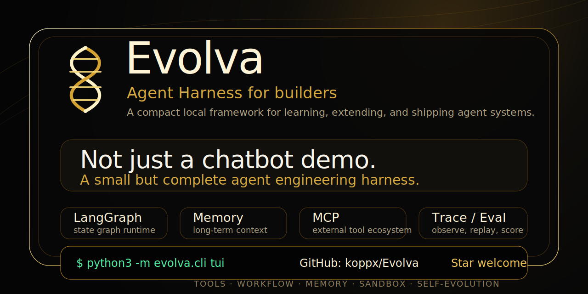

<p align="center">
  
</p>

<h1 align="center">Evolva</h1>

<p align="center">
  <strong>Local-first Self-Evolving Agent Harness</strong><br />
  A compact project that exposes agent runtime, tools, memory, evals, tracing, safety, and evolution loops.
</p>

<p align="center">
  <a href="README.md">中文</a> · <a href="#quick-start">Quick Start</a> · <a href="#capability-map">Capability Map</a> · <a href="#self-evolution">Self-Evolution</a>
</p>

<p align="center">
  
  
  
  
  
</p>

---

## Why Evolva

Many agent demos stop at chatbot behavior. Evolva is different: it keeps the system small while exposing the engineering pieces that make an agent inspectable and extensible.

```text
Plan -> Act -> Observe -> Evaluate -> Evolve
```

Use it as a learning harness, a local agent playground, or a base for your own agent framework.

## Quick Start

```bash
git clone git@github.com:koppx/Evolva.git
cd Evolva
python3 -m pip install -e ".[dev]"

# Optional: any OpenAI-compatible endpoint
export OPENAI_API_KEY="..."
export OPENAI_MODEL="gpt-4o-mini"

python3 -m evolva.cli chat
```

More entry points:

```bash
python3 -m evolva.cli tui
python3 -m evolva.cli ask "Remember: run tests after editing Python"
python3 -m evolva.cli ask "Describe this image" --image evolva/workspace/example.png
```

Without `OPENAI_API_KEY`, Evolva falls back to a limited local rule-based mode. Local tools, memory, skills, todo, traces, workflows, and evals remain available.

## Capability Map

| Capability | What it does | Entry |
| --- | --- | --- |
| **LangGraph Runtime** | Explicit `StateGraph` nodes: `prepare -> llm -> tool -> observe -> persist -> auto_evolve` | `evolva/agent/langgraph_runtime.py` |
| **CLI / TUI** | Interactive chat, one-shot ask, curses TUI | `python3 -m evolva.cli chat` / `tui` |
| **Tools** | File, shell, Python, web, todo, memory, context, policy, MCP, delegation | `/tools` / `/run` |
| **Memory / Skills** | Long-term facts, preferences, lessons, Markdown playbooks | `/memory` / `/skills` |
| **MCP** | stdio MCP client for external tool servers | `python3 -m evolva.cli mcp ...` |
| **Workflow** | JSON workflow specs with role agents, agent calls, and tool nodes | `python3 -m evolva.cli workflow ...` |
| **Trace / Replay** | Prompts, tool calls, policy decisions, latency, errors, outputs | `python3 -m evolva.cli trace ...` |
| **Eval Harness** | JSONL tasks with text, regex, artifacts, memory, context, and tool-error checks | `python3 -m evolva.cli eval ...` |
| **Guardrails / Sandbox** | Path sandbox, dangerous command denylist, risk scoring, secret detection, approvals | `/policy` |
| **Self-Evolution** | Turns feedback, trace patterns, and eval failures into memory and skills | `python3 -m evolva.cli evolve ...` |

## Architecture

<p align="center">
  
</p>

Evolva is organized into three lanes:

1. **Reasoning & State**: CLI / TUI enters Evolva Core. The LangGraph runtime manages state and assembles Memory, Skills, Todo, and Context.
2. **Guarded Execution**: tool calls pass through Policy and Sandbox before reaching files, shell, Python, web, MCP, workflows, and sub agents.
3. **Feedback Loop**: Trace records behavior, Eval checks regressions, and Evolution distills feedback into long-term memory and reusable skills.

## Self-Evolution

Evolva's evolution loop is a concrete state update pipeline:

```text
Feedback / Trace Pattern / Eval Failure
        ↓
Reflection
        ↓
Long-term Memory
        ↓
Markdown Skill
        ↓
Future Prompt Context
```

Examples:

```bash
python3 -m evolva.cli evolve feedback "After editing Python files, run syntax checks and pytest."
python3 -m evolva.cli evolve trace --apply
python3 -m evolva.cli evolve eval --apply
```

The resulting lessons are persisted in memory and can be materialized as Markdown skills for future context injection.

## Daily Commands

```bash
# Chat / TUI / Ask
python3 -m evolva.cli chat
python3 -m evolva.cli tui
python3 -m evolva.cli ask "Plan a local agent demo"

# Trace
python3 -m evolva.cli trace list
python3 -m evolva.cli trace show <run_id>
python3 -m evolva.cli trace replay <run_id>

# Eval
python3 -m evolva.cli eval evals/tasks/smoke.jsonl --yes

# Workflow
python3 -m evolva.cli workflow path/to/workflow.json --yes

# MCP
python3 -m evolva.cli mcp servers
python3 -m evolva.cli mcp tools filesystem
python3 -m evolva.cli mcp call filesystem list_directory '{"path":"."}' --yes

# Self-evolution
python3 -m evolva.cli evolve status
python3 -m evolva.cli evolve trace --apply
python3 -m evolva.cli evolve eval --apply
```

<details>
<summary><strong>Interactive Slash Commands</strong></summary>

```text
/help                     Show help
/tools                    List tools
/skills                   List skills
/memory [query]           Show or search long-term memory
/memory stats             Show memory statistics
/memory recent [n]        Show recent memories
/context [query]          Show persistent context
/todo                     Show todo list
/todo add <title>         Add a todo
/todo done <id>           Mark a todo as done
/agents                   List role agents
/trace list               List recent traces
/trace show <run_id>      Show one trace
/policy                   Show guardrail policy
/mcp                      List MCP servers
/mcp tools [server]       List MCP tools
/image <path|url> [text]  Ask with an image
/evolve [feedback]        Turn feedback into memory + skill
/workflow <json>          Run a workflow spec
/run <tool> <json>        Call a tool directly
/exit                     Quit
```

</details>

## Workflow Example

```json
{
  "id": "demo_workflow",
  "nodes": [
    {"id": "plan", "type": "role", "role": "planner", "task": "Plan a Python demo"},
    {"id": "write", "type": "tool", "tool": "write_file", "args": {"path": "evolva/workspace/demo.py", "content": "print('hello from Evolva')\n"}},
    {"id": "run", "type": "tool", "tool": "shell", "args": {"command": "python3 evolva/workspace/demo.py"}}
  ]
}
```

## Eval Example

```json
{"id":"tool_write_read_001","input":"Create hello.py and run it","expected_artifacts":["evolva/workspace/hello.py"],"expected_contains":["hello"],"scorers":["no_tool_error"]}
```

Supported checks include `expected_contains`, `forbidden_contains`, `expected_regex`, `expected_artifacts`, `expected_memory`, `expected_context`, `max_duration_ms`, and `no_tool_error`.

## TUI Preview

<p align="center">
  
</p>

## Workflow / MCP / Memory

<p align="center">
  
</p>

## Safety Model

Evolva is local-first and can execute file, shell, and Python operations, so it ships with multiple guardrails by default:

- **Sandbox root**: file tools resolve paths through the workspace sandbox to prevent path escape.
- **Dangerous command denylist**: blocks patterns such as `rm -rf /`, `git reset --hard`, `mkfs`, and `shutdown`.
- **Policy engine**: scores shell / Python, network, path, and secret-pattern risks.
- **Confirmation gate**: shell, Python, and MCP tools can require approval unless `--yes` is set.
- **Trace audit**: decisions, tool calls, failures, and final answers are persisted for review.

## Development

```bash
PYTHONPYCACHEPREFIX=.pycache python3 -m compileall evolva tests
python3 -m pytest -q
```

## Project Structure

```text
evolva/
  cli.py                     CLI entry
  tui.py                     curses terminal UI
  agent/core.py              public agent facade
  agent/langgraph_runtime.py LangGraph StateGraph runtime
  agent/evolution.py         lesson + skill evolution engine
  agent/evolution_analyzer.py trace / eval evolution analyzer
  agent/images.py            local/URL image input
  agent/mcp.py               stdio MCP client
  agent/memory.py            long-term memory
  agent/policy.py            guardrails and risk decisions
  agent/sandbox.py           workspace sandbox and execution
  tools/builtin.py           built-in tool registry
  eval/harness.py            JSONL eval runner
  workflow/engine.py         workflow DAG engine
assets/
  evolva-hero.svg
  architecture.svg
  tui-mockup.svg
  workflow-mcp-memory.svg
```

---

<p align="center">
  <strong>Evolva</strong> · Local, inspectable, self-evolving agents.<br />
  If this project helps you, star <strong>koppx/Evolva</strong>.
</p>
