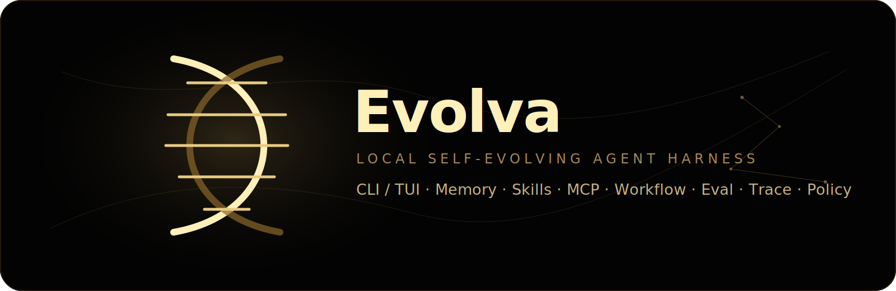
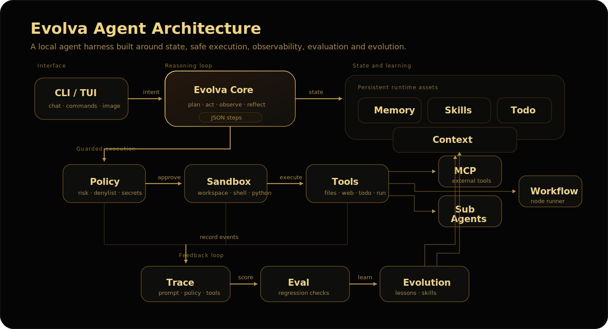
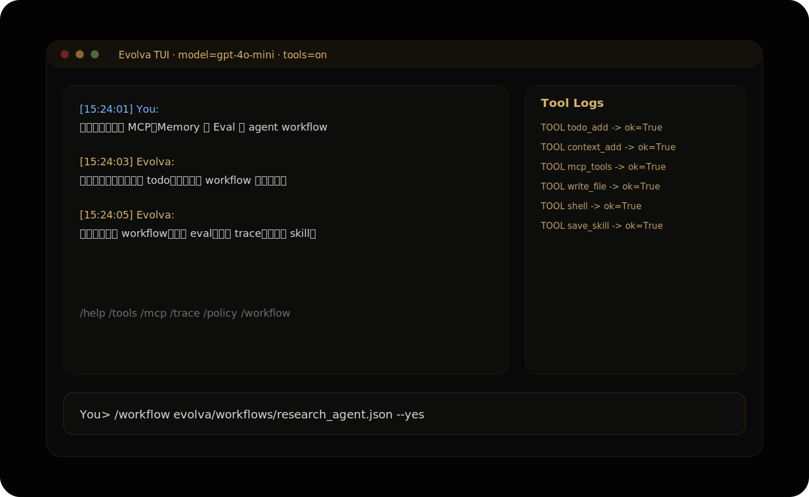

<p align="center">
  
</p>

<h1 align="center">Evolva</h1>

<p align="center">
  <strong>Local Self-Evolving Agent Harness</strong><br />
  CLI / TUI · Memory · Skills · MCP · Workflow · Eval · Trace · Policy
</p>

<p align="center">
  
  
  
  
  
</p>

---

**Evolva** 是一个轻量级本地 Agent 工程框架，面向 CLI/TUI 对话场景，内置规划、工具调用、长短期记忆、技能沉淀、MCP 外部工具生态、Workflow 编排、Trace 可观测性、Eval 评测闭环、Guardrails 策略防护与自我进化能力。

它的目标不是只做一个聊天壳，而是提供一个可以拆解、观测、评测、扩展和持续演进的 **Agent Harness**。

## Highlights

| Layer | Capability | What it gives you |
| --- | --- | --- |
| Interface | CLI / TUI / Ask | 多轮对话、单次提问、终端仪表盘、工具日志侧栏 |
| Reasoning Loop | Plan → Act → Observe → Reflect | 规划、工具执行、上下文写入、失败反思 |
| Memory | Long-term memory + context store | facts / preferences / lessons / artifacts / decisions 持久化 |
| Tools | Files / shell / python / web / todo | 本地工作区执行、代码生成、状态管理、直接工具调用 |
| Skills | Markdown skill library | 将经验沉淀为可复用 playbook，支持自我进化更新 |
| MCP | stdio MCP client | 接入外部 MCP server，扩展工具生态 |
| Workflow | JSON DAG runner | 串联 agent 节点、role 节点、tool 节点，编排长任务 |
| Eval | JSONL eval harness | 任务集、artifact 检查、文本检查、工具错误 scorer |
| Observability | Trace list/show/replay | 记录 prompt、policy、tool call、latency、final answer |
| Safety | Policy engine + sandbox | 路径逃逸检查、危险命令拦截、secret pattern 检测、确认机制 |

## Visual Overview

### Agent Architecture

<p align="center">
  
</p>

### TUI Experience

<p align="center">
  
</p>

### Workflow / MCP / Memory Loop

<p align="center">
  
</p>

## Quick Start

```bash
# 1. Clone and enter the project
git clone git@github.com:koppx/Evolva.git
cd Evolva

# 2. Optional: install editable package
python3 -m pip install -e ".[dev]"

# 3. Optional: configure any OpenAI-compatible endpoint
export OPENAI_API_KEY="..."
export OPENAI_MODEL="gpt-4o-mini"
# export OPENAI_BASE_URL="https://api.openai.com/v1"

# 4. Start chatting
python3 -m evolva.cli chat

# Or launch terminal UI
python3 -m evolva.cli tui
```

> 没有配置 `OPENAI_API_KEY` 也可以运行。Evolva 会进入有限规则模式，仍支持 `/help`、`/tools`、`/memory`、`/skills`、`/todo`、`/evolve`、`/run` 等本地命令。

## Command Console

### Interactive modes

```bash
python3 -m evolva.cli chat
python3 -m evolva.cli tui
python3 -m evolva.cli ask "记住：写完 Python 后运行测试"
python3 -m evolva.cli ask "请描述这张图" --image evolva/workspace/example.png
```

### Slash commands

```text
/help                查看帮助
/tools               列出工具
/skills              列出技能
/memory [query]      查看或搜索长期记忆
/context [query]     查看或搜索持久上下文
/todo                查看 TodoList
/todo add <title>    添加 todo
/todo done <id>      标记 todo 完成
/agents              列出多 agent 角色
/trace list          查看最近执行 trace
/trace show <run>    查看单次执行详情
/policy              查看 guardrail 策略
/mcp                 查看 MCP servers
/mcp tools [server]  查看 MCP tools
/image <path|url> [text]
                     对图片提问，需要视觉模型
/evolve [feedback]   基于反馈/最近对话自我进化
/workflow <json>     运行 workflow spec
/run <tool> <json>   直接调用工具，例如 /run list_files {"path":"."}
/exit                退出
```

## Core Workflows

### 1. Trace: make every run inspectable

```bash
python3 -m evolva.cli trace list
python3 -m evolva.cli trace show <run_id>
python3 -m evolva.cli trace replay <run_id>
```

每轮执行会记录：输入、LLM 状态、policy decision、tool call、latency、失败工具和最终回答，方便 debug、复盘和回放。

### 2. Eval: keep agent behavior measurable

```bash
python3 -m evolva.cli eval evals/tasks/smoke.jsonl --yes
```

Eval task 示例：

```json
{"id":"tool_write_read_001","input":"创建 hello.py 并运行","expected_artifacts":["evolva/workspace/hello.py"],"expected_contains":["hello"],"scorers":["no_tool_error"]}
```

结果会写入：

```text
evolva/eval_results/*.json
```

### 3. Workflow: compose tools and role agents

```bash
python3 -m evolva.cli workflow path/to/workflow.json --yes
```

Workflow spec 示例：

```json
{
  "id": "demo_workflow",
  "nodes": [
    {"id": "plan", "type": "role", "role": "planner", "task": "规划一个 Python demo"},
    {"id": "write", "type": "tool", "tool": "write_file", "args": {"path": "evolva/workspace/demo.py", "content": "print('hello from Evolva')\n"}},
    {"id": "run", "type": "tool", "tool": "shell", "args": {"command": "python3 evolva/workspace/demo.py"}}
  ]
}
```

### 4. MCP: plug into external tool ecosystems

Evolva 内置轻量 stdio MCP client。默认不会启动外部 MCP server，可以复制示例配置后按需启用：

```bash
cp evolva/mcp/servers.example.json evolva/mcp/servers.json
# 编辑 evolva/mcp/servers.json，将需要的 server enabled 改为 true

python3 -m evolva.cli mcp servers
python3 -m evolva.cli mcp tools filesystem
python3 -m evolva.cli mcp call filesystem list_directory '{"path":"."}' --yes
```

对话中也可以直接调用：

```text
/mcp
/mcp tools filesystem
/run mcp_call {"server":"filesystem","tool":"list_directory","arguments":{"path":"."}}
```

## TUI

```bash
python3 -m evolva.cli tui
python3 -m evolva.cli tui --yes        # 工具执行不再逐次确认
python3 -m evolva.cli tui --no-tools   # 启动时隐藏工具日志侧栏
```

快捷键：

```text
Enter          发送消息或命令
Tab            补全 /help /tools /skills /memory /evolve /run /exit
Ctrl+T         显示/隐藏工具日志侧栏
Ctrl+L         清空当前屏幕消息
PgUp/PgDn      滚动聊天区
Up/Down        切换历史输入
Esc            清空当前输入
```

## Self-Evolution Model

Evolva 的自我进化不是修改自身源码，而是把可复用经验沉淀成可检索、可复用、可迭代的运行时资产：

```text
Feedback / Failure / Success
        ↓
Reflection
        ↓
Long-term Memory: facts / preferences / lessons
        ↓
Skill Library: markdown playbooks
        ↓
Future Prompt Context + Tool Strategy
```

你可以显式触发：

```text
/evolve 以后写 Python 文件后自动运行语法检查和 pytest
```

也可以让 Agent 在工具失败、长答案或复杂任务后自动记录 lesson。

## Safety Model

Evolva 是本地 Agent，具备文件、shell 和 Python 执行能力，因此默认提供多层防护：

- **Sandbox root**：文件工具统一通过 sandbox 解析路径，阻止路径逃逸。
- **Dangerous command denylist**：拦截 `rm -rf /`、`git reset --hard`、`mkfs`、`shutdown` 等高危片段。
- **Policy engine**：对 shell/python、网络、路径、secret pattern 进行风险分级。
- **Confirmation gate**：非 `--yes` 模式下，shell/python/MCP 等高风险工具需要确认。
- **Trace audit**：关键决策、工具调用、失败信息都会进入 trace，便于审计和复盘。

## Testing

```bash
PYTHONPYCACHEPREFIX=.pycache python3 -m compileall evolva tests
python3 -m pytest -q
```

当前测试覆盖核心状态存储、工具系统、Agent fallback、CLI、TUI 非 curses 逻辑、Workflow、MCP、Eval、LLM wrapper、图片输入与安全策略：

```text
49 passed
```

## Project Structure

```text
evolva/
  cli.py                CLI / command entry
  tui.py                curses terminal UI
  agent/core.py         plan-act-observe-reflect loop
  agent/context.py      persistent context store
  agent/evolution.py    lesson + skill evolution engine
  agent/images.py       local/URL image input helpers
  agent/llm.py          OpenAI-compatible client
  agent/mcp.py          stdio MCP client
  agent/memory.py       long-term memory store
  agent/multi_agent.py  planner/researcher/coder/reviewer roles
  agent/policy.py       guardrails and risk decisions
  agent/sandbox.py      workspace sandbox and execution
  agent/skills.py       markdown skill library
  agent/todo.py         persistent todo list
  agent/tracing.py      trace record/show/replay
  tools/builtin.py      builtin tool registry
  eval/harness.py       JSONL eval runner
  workflow/engine.py    workflow DAG engine
  mcp/servers.example.json
assets/
  readme-banner.svg
  architecture.svg
  tui-mockup.svg
  workflow-mcp-memory.svg
evals/
  tasks/smoke.jsonl
tests/
  pytest coverage for core modules
```

## Design Principles

- **Local-first**：默认围绕本地工作区运行，不强依赖外部服务。
- **Inspectable**：Trace、Eval、Context、Todo 都是可落盘查看的工程资产。
- **Composable**：工具、MCP、Workflow、Role Agent 可以组合成更复杂的执行链。
- **Evolvable**：记忆与技能让 Agent 从反馈和失败中形成长期改进。
- **Safe by default**：高风险执行路径通过 sandbox、policy 和 confirmation 限制。

---

<p align="center">
  <strong>Evolva</strong> · Build agents that remember, inspect, evaluate, and evolve.
</p>
